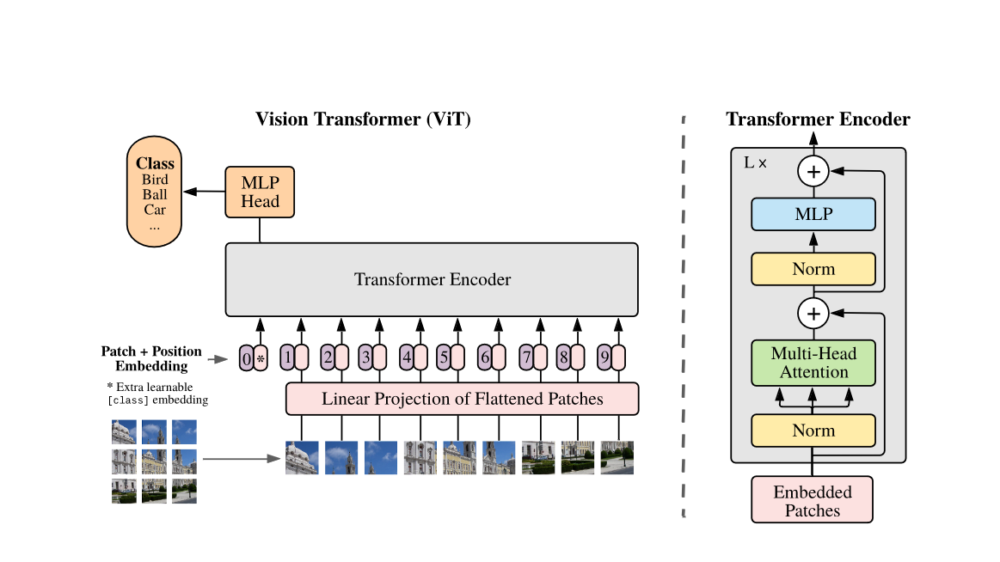

# Vision Transformer (ViT) Replication

This repository contains code for replicating the Vision Transformer (ViT) model proposed in the paper "[An Image is Worth 16x16 Words: Transformers for Image Recognition at Scale](https://arxiv.org/abs/2010.11929)" by Dosovitskiy et al.

</img>

## References
- [Official implementation of ViT](https://github.com/google-research/vision_transformer)
- [ViT paper](https://arxiv.org/abs/2010.11929) by Dosovitskiy et al.